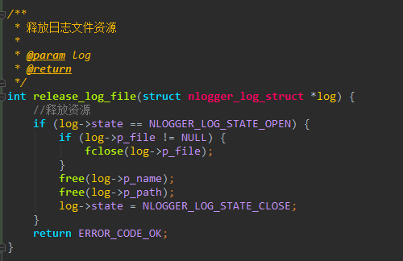
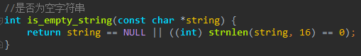
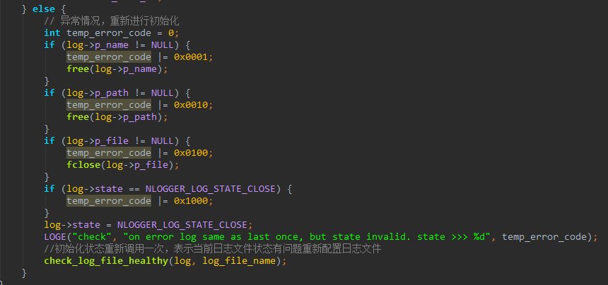
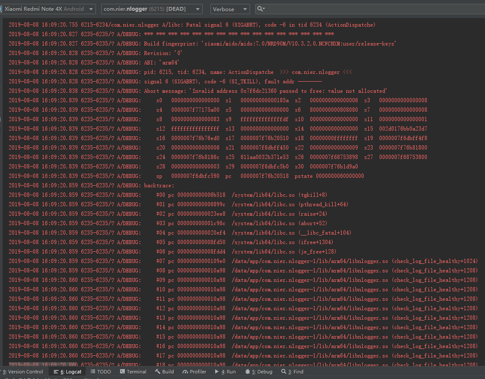

# malloc & free

### 场景
在尝试释放某个内存段时用了free函数来释放malloc获得的内存

如上所示，然后代码紧接着去判断对应字段是否是NULL

此时我预期的是`is_empty_string(log->p_name)`判断会通过，结果判断却未通过，对应指针的数据不为NULL；

然后逻辑就走到了下面的代码

这段代码写的也有问题，这里判断字段不是NULL则取free，导致代码发生**double free**，然后崩溃报错；

### 原因
free函数只是释放malloc的资源，指针任然会指向原来的地址，只不过这段地址现在可以被其他人maloc获取，而这个指针也就是一个野指针。free和NULL其实没有任何关系。

正确的做法是free后主动将需要复用的指针指向NULL

